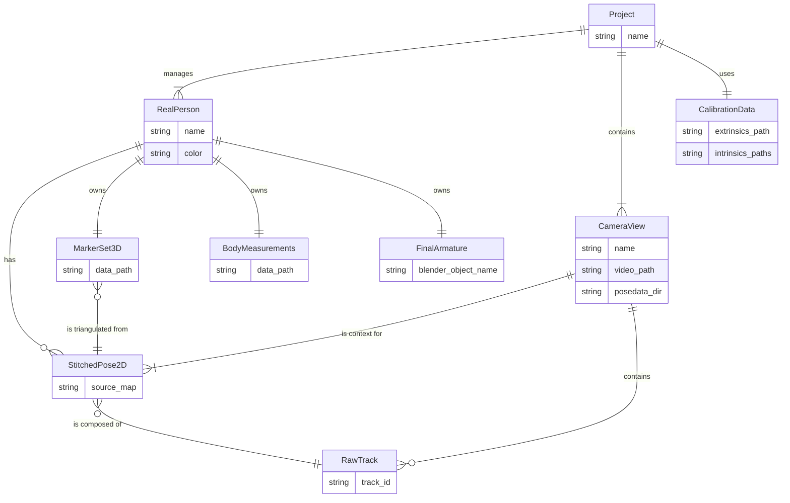
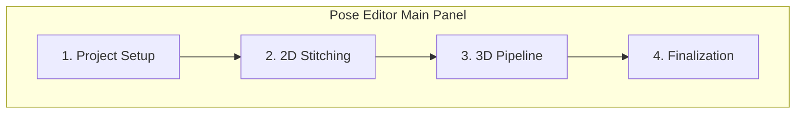
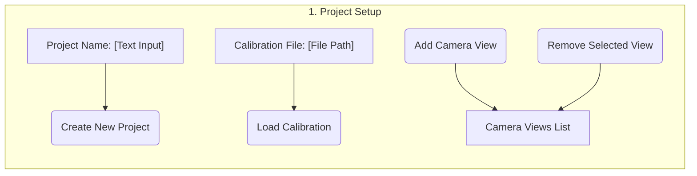
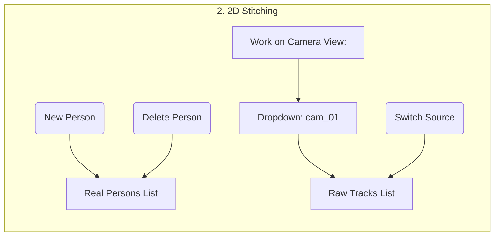
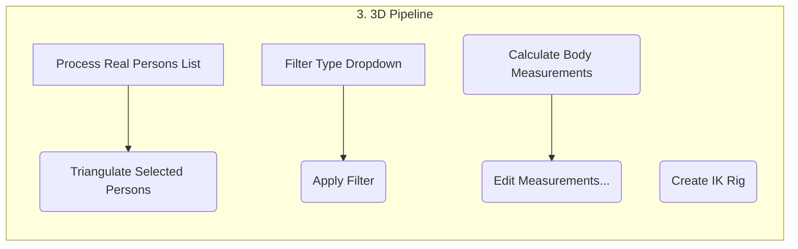
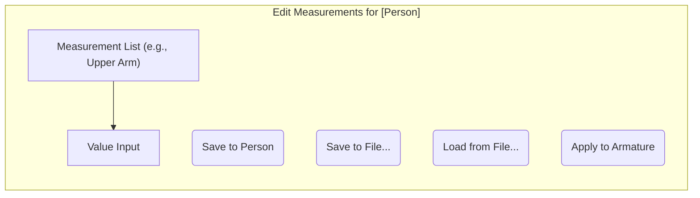
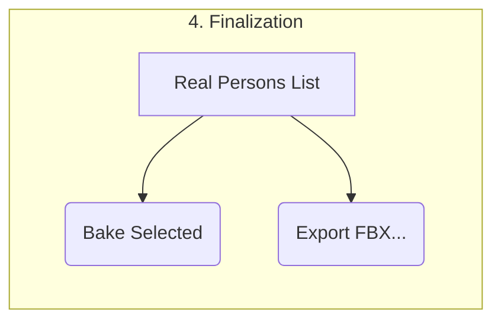

# Blender Add-on: Pose-Editor Design

## 1. Overview
This document outlines the design for a Blender add-on that provides an end-to-end pipeline for editing motion capture data. The workflow starts with editing 2D pose data captured from video, progresses to 3D reconstruction, and finishes with a fully rigged and animated 3D character.

The add-on is designed to handle complex scenarios with multiple camera angles and multiple people. The entire pipeline is centered around the concept of a **"Real Person"**, a primary data object that links together the 2D, 3D, and final armature data for a single individual. The add-on will heavily integrate with **Pose2Sim**, a third-party Python library, to handle 3D triangulation, data filtering, and body measurement estimation.

## 2. The "Real Person" Concept
The "Real Person" is the central, cross-cutting entity in the application. When a user creates a Real Person (e.g., "Alice"), they are creating a master data container that will be populated throughout the workflow. This single entity will own and link together all of the following data components:

-   **Stitched 2D Marker Sets:** A collection of 2D marker sets, one for each camera view where the person is present. Each set is the result of the 2D identity stitching process.
-   **Triangulated 3D Marker Set:** A single set of animated 3D markers, generated by triangulating the various 2D marker sets.
-   **Body Measurements:** A data structure holding the person's estimated body measurements, calculated from the 3D markers and editable by the user. These can be saved and reused.
-   **Final 3D Armature:** The final, scaled, and rigged 3D character armature that is animated by the 3D markers.

This structure ensures that all data associated with a single performer is kept organized and connected from the beginning of the pipeline to the end.

## 3. Core Workflows & Requirements

### 3.1. 2D Pose Editing
- **Multi-Camera/Multi-Person:** Support loading multiple camera views (video + 2D pose data) and provide a workflow for stitching fragmented person tracks into continuous "Real Person" entities.
- **Synced Video:** Display the source video as a synchronized background for direct visual reference during editing.
- **Blender-Native Editing:** All 2D marker data should be editable using standard Blender tools (3D Viewport, Graph Editor, Dope Sheet).
- **Hierarchical Tools:** Provide tools for selecting and manipulating entire limbs (e.g., "Select Children" command that also sets the pivot point).

### 3.2. 3D Motion Capture Pipeline
- **Camera Calibration:** Load and manage camera calibration data (intrinsics/extrinsics in OpenCV format) required for 3D reconstruction.
- **3D Triangulation:** Use `Pose2Sim` to triangulate the corrected 2D marker data from multiple views into a 3D pose. This process is iterative.
- **3D Data Filtering:** Integrate `Pose2Sim`'s filters (e.g., Butterworth, Kalman) to process the raw 3D marker animation curves.
- **Armature Fitting:** Provide a workflow to scale a standard armature to a person's estimated body measurements (calculated via `Pose2Sim`) and then rig it to be driven by the 3D markers using Blender's IK constraints.
- **Finalization:** Bake the IK-driven animation onto the armature and provide export options.

## 4. Detailed Pipeline Stages

### 4.1. 2D Identity Stitching
This phase builds the initial 2D data for a "Real Person".
- **Initial Visualization:** All raw tracks are loaded, each with its own annotated skeleton and markers.
- **"Real Person" Creation:** The user creates a "Real Person" entity, which serves as the master container for that individual's data.
- **Stitching via Keyframed Index:** A custom property (`active_track_index`) on the Real Person's 2D armature (for a specific view) is keyframed over time to dynamically switch between the raw tracks used as the data source.

### 4.2. 2D Editing and Interaction
- **Manual Keyframing:** Moving a marker automatically sets its `likelihood` to 1.0.
- **Occlusions:** Users can keyframe a `visible` property to mark markers as occluded.
- **Hierarchical Posing:** A "Select Children" command selects a limb and sets the pivot to the root joint for intuitive rotation.

### 4.3. Camera Calibration Management
- **Separation of Concerns:** Calibration data is managed separately from pose data, allowing calibrations to be reused across projects and sessions.
- **Data Structure:**
    - An **Extrinsics** file defines the positions of all cameras in a session.
    - Each camera in the Extrinsics file references an **Intrinsics** file.
    - Each 2D pose data set loaded into the project is linked to a specific camera from the active Extrinsics set.
- **UI:** The add-on will provide a panel for loading and managing these calibration files.

### 4.4. 3D Triangulation
- **Engine:** Uses a function from the `Pose2Sim` library.
- **Inputs:** The collection of stitched 2D marker sets belonging to a "Real Person" and the corresponding camera calibration data.
- **Process:** The user selects a "Real Person" to triangulate. The add-on gathers the 2D data from all associated camera views and passes it to `Pose2Sim`.
- **Output:** A set of 3D markers are generated and associated with the selected "Real Person". Metadata (reprojection error, contributing views) is stored as custom properties on each 3D marker.
- **Iterative Workflow:** The user can review the 3D output, go back to the 2D views to correct markers, and then re-run triangulation.

### 4.5. 3D Data Filtering
- **Engine:** Uses filtering functions from `Pose2Sim`.
- **Process:** The user selects a "Real Person's" 3D marker set and applies one or more filters.
- **Reversibility:** The original, unfiltered f-curves are stored, allowing the user to revert the filtering operation.

### 4.6. Armature Fitting and Rigging
1.  **Armature Scaling:**
    *   **Measurement Estimation:** Use `Pose2Sim` to estimate body measurements from the "Real Person's" 3D marker data.
    *   **Data Association:** These measurements are stored as part of the "Real Person" entity and can be saved/loaded independently.
    *   **Application:** The user selects a target armature, and the add-on scales its bones to match the person's measurements.
2.  **IK Rigging:**
    *   The add-on automatically creates an IK rig on the scaled armature, targeting the "Real Person's" 3D markers.

### 4.7. Finalization
- **Baking:** The user bakes the animation for a "Real Person", transferring the motion from the IK rig to the deforming bones of the final armature.
- **Export:** The baked armature can be exported.

## 5. Overall Key Use Case Flow
1.  **Project Setup:** Load camera views and camera calibration files.
2.  **2D Stitching & Editing:** Create "Real Person" entities. For each person, stitch and edit their 2D marker data in all relevant camera views.
3.  **3D Triangulation:** For each "Real Person", run triangulation on their collected 2D data to generate their 3D marker set.
4.  **Iterative 3D/2D Refinement:** Review the 3D markers. If errors exist, go back to the 2D views for that person, fix the markers, and re-triangulate.
5.  **3D Filtering:** Apply smoothing filters to the "Real Person's" 3D marker animation.
6.  **Armature Scaling:** For each "Real Person", generate/load their body measurements and scale a target armature.
7.  **IK Rigging:** Create the IK rig for each person's armature, linking it to their 3D markers.
8.  **Baking & Export:** Bake the final animation onto the armatures and export.

## 6. Data Model
This section describes the overall data model for the application. These entities and their relationships represent the core data that the add-on will manage.

### 6.1. Entity Relationship Diagram
This diagram provides a high-level overview of the main data entities and their connections.

### 6.2. Entity Descriptions

#### Project
The top-level container for a single motion capture session.
-   **Properties**:
    -   `name`: A unique name for the project.
    -   `real_persons`: A list of `RealPerson` entities managed within the project.
    -   `camera_views`: A list of `CameraView` entities used in the project.
    -   `calibration`: A reference to the active `CalibrationData` object.
-   **Relationships**:
    -   Has one-to-many `RealPerson`s.
    -   Has one-to-many `CameraView`s.
    -   Has one `CalibrationData` set.

#### RealPerson
The central entity representing a single, unique performer. It acts as a master container for all data related to that individual.
-   **Properties**:
    -   `name`: A unique, user-defined name (e.g., "Alice").
    -   `color`: A unique color used for UI elements related to this person.
    -   `stitched_2d_poses`: A dictionary mapping `CameraView` names to `StitchedPose2D` objects.
    -   `marker_set_3d`: A reference to the `MarkerSet3D` object after triangulation.
    -   `body_measurements`: A reference to the `BodyMeasurements` object.
    -   `final_armature`: A reference to the final, rigged and animated Blender armature.
-   **Relationships**:
    -   Belongs to one `Project`.
    -   Has one `StitchedPose2D` for each `CameraView` it appears in.
    -   Has one `MarkerSet3D`, one `BodyMeasurements` object, and one `FinalArmature`.

#### CameraView
Represents a single camera's viewpoint and its associated data files.
-   **Properties**:
    -   `name`: A unique name for the camera (e.g., "cam_01").
    -   `video_path`: Filesystem path to the background video file.
    -   `posedata_dir`: Filesystem path to the directory of raw 2D pose JSON files.
    -   `raw_tracks`: A list of `RawTrack` objects loaded from the `posedata_dir`.
    -   `calibration_id`: The ID or name of the specific camera within the project's `CalibrationData` this view corresponds to.
-   **Relationships**:
    -   Belongs to one `Project`.
    -   Contains many `RawTrack`s.

#### RawTrack
A data object representing a single, continuous but fragmented track from the initial pose detection software (e.g., `person_0`, `person_1`).
-   **Properties**:
    -   `track_id`: The identifier from the source JSON file.
    -   `data`: The raw NumPy array of frame-by-frame marker data (x, y, likelihood).
-   **Relationships**:
    -   Belongs to one `CameraView`.
    -   Is used as a source for a `StitchedPose2D` object.

#### StitchedPose2D
Represents the continuous, corrected 2D pose for a `RealPerson` within a single `CameraView`.
-   **Properties**:
    -   `data`: The final NumPy array of 2D marker data after stitching and editing.
    -   `source_map`: A data structure (e.g., a list of tuples) indicating which `RawTrack` and frame range was used for each part of the animation (e.g., `[('track_a', 1, 100), ('track_c', 101, 200)]`). This is driven by the `active_track_index` keyframes.
-   **Relationships**:
    -   Belongs to one `RealPerson` and one `CameraView`.
    -   Is composed of data from one or more `RawTrack`s.

#### MarkerSet3D
Represents the animated 3D markers for a `RealPerson`.
-   **Properties**:
    -   `data`: The NumPy array of 3D marker data (x, y, z) post-triangulation and filtering.
    -   `markers`: A list of Blender empty objects that are animated by the `data`.
    -   Each marker object in Blender will have custom properties for metadata like `reprojection_error`.
-   **Relationships**:
    -   Belongs to one `RealPerson`.
    -   Is generated from two or more `StitchedPose2D` objects.

## 7. UI Components and Flow
This chapter describes the UI panels and workflows for the add-on. The main UI will be located in the Blender 3D View's sidebar (N-Panel) under a "Pose Editor" tab.

### 7.1. Main Panel Layout
The main panel will use a tabbed or accordion layout to organize the pipeline into clear, sequential steps.

### 7.2. Project Setup Panel
**Flow:** The user starts here to define the project, load calibration, and add camera views.
1.  User clicks "New Project" and gives it a name.
2.  User clicks "Load Calibration" and selects the main extrinsics file.
3.  User clicks "Add Camera View" repeatedly, for each view selecting the video file and pose data directory.

**Layout:**

### 7.3. 2D Identity Stitching Panel
**Flow:** After setting up the project, the user moves to this tab to assign raw tracks to real people.
1.  Select a `Camera View` from a dropdown. This populates the `Raw Tracks` list.
2.  Create a `Real Person` by giving them a name and color.
3.  Select the desired `Real Person` and the first `Raw Track` they correspond to.
4.  Scrub the timeline. When the tracking ID changes, select the new `Raw Track` and click "Switch Source" to insert a keyframe.

**Layout:**

### 7.4. 3D Pipeline Panel
**Flow:** Once 2D data is clean, the user moves here to create the 3D animation.
1.  Select one or more `Real Persons` to process.
2.  Click "Triangulate" to generate the 3D markers.
3.  Select a filter from the dropdown and click "Apply Filter".
4.  Click "Calculate Body Measurements" and then "Edit" to open the measurement editor.
5.  Click "Create IK Rig" to rig the armature.

**Layout:**

### 7.5. Body Measurement Editor
**Flow:** This UI opens in a separate window (or as a sub-panel) when the user clicks "Edit Measurements". It allows fine-tuning of the `Pose2Sim` output before scaling the armature.

**Layout:**

### 7.6. Finalization Panel
**Flow:** The final step for baking and exporting the animation.

**Layout:**
