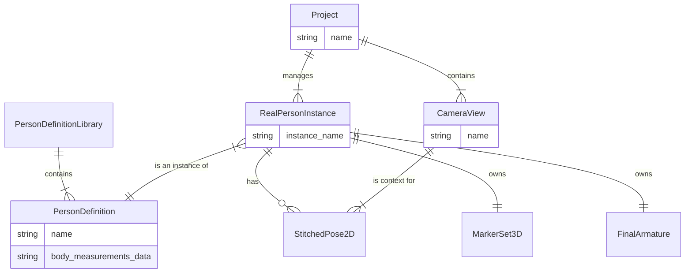
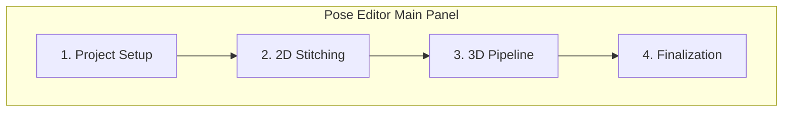
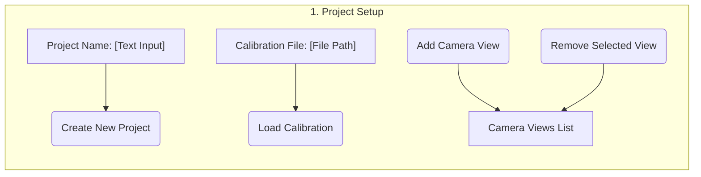
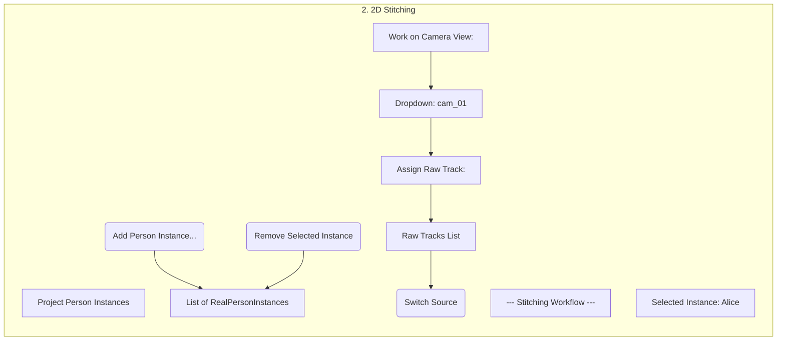
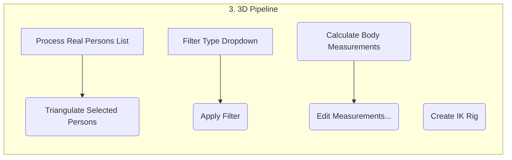
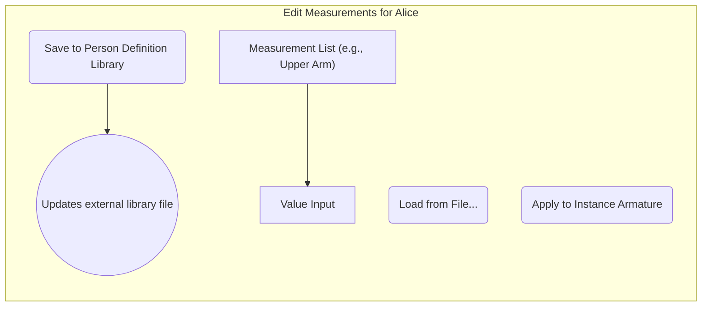
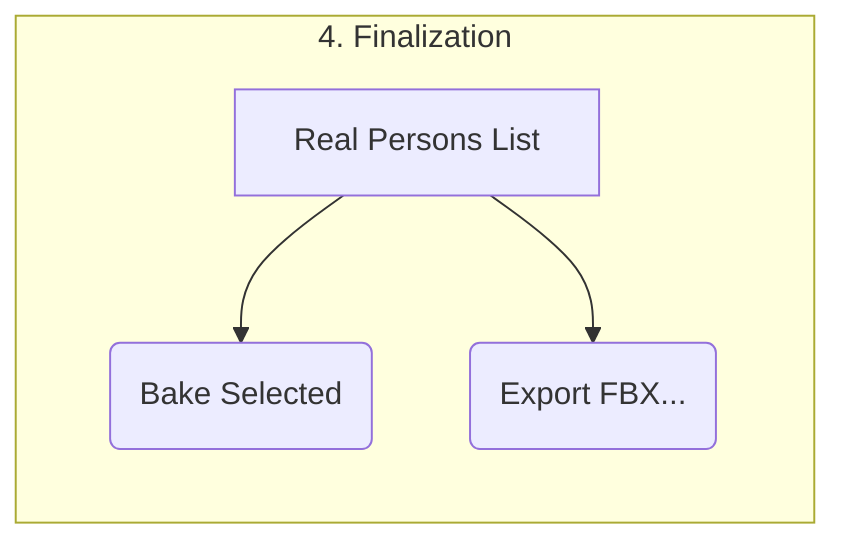

# Blender Add-on: Pose-Editor Design

## 1. Overview
This document outlines the design for a Blender add-on that provides an end-to-end pipeline for editing motion capture data. The workflow starts with editing 2D pose data captured from video, progresses to 3D reconstruction, and finishes with a fully rigged and animated 3D character.

The add-on is designed to handle complex scenarios with multiple camera angles and multiple people. The entire pipeline is centered around the concept of a **"Real Person"**, a primary data object that links together the 2D, 3D, and final armature data for a single individual. The add-on will heavily integrate with **Pose2Sim**, a third-party Python library, to handle 3D triangulation, data filtering, and body measurement estimation.

## 2. The "Real Person" Concept
To support reusability, the data model separates a person's persistent definition from their instance in a specific project.

-   **Person Definition:** A reusable profile for a unique individual, containing their name and body measurements. These are stored globally in a library managed by the add-on.
-   **Real Person Instance:** Represents a `Person Definition` within a specific `.blend` project. It contains all the project-specific data, such as the stitched 2D poses, the 3D markers, and the final animated armature.

This structure ensures that performer-specific data (like body measurements) can be created once and reused across many different recordings and projects.

## 3. Core Workflows & Requirements

### 3.1. 2D Pose Editing
- **Multi-Camera/Multi-Person:** Support loading multiple camera views (video + 2D pose data) and provide a workflow for stitching fragmented person tracks into continuous "Real Person" instances.
- **Synced Video:** Display the source video as a synchronized background for direct visual reference during editing.
- **Blender-Native Editing:** All 2D marker data should be editable using standard Blender tools (3D Viewport, Graph Editor, Dope Sheet).
- **Hierarchical Tools:** Provide tools for selecting and manipulating entire limbs (e.g., "Select Children" command that also sets the pivot point).

### 3.2. 3D Motion Capture Pipeline
- **Camera Calibration:** Load and manage camera calibration data (intrinsics/extrinsics in OpenCV format) required for 3D reconstruction.
- **3D Triangulation:** Use `Pose2Sim` to triangulate the corrected 2D marker data from multiple views into a 3D pose. This process is iterative.
- **3D Data Filtering:** Integrate `Pose2Sim`'s filters (e.g., Butterworth, Kalman) to process the raw 3D marker animation curves.
- **Armature Fitting:** Provide a workflow to scale a standard armature to a person's estimated body measurements (loaded from their `Person Definition`) and then rig it to be driven by the 3D markers using Blender's IK constraints.
- **Finalization:** Bake the IK-driven animation onto the armature and provide export options.

## 4. Detailed Pipeline Stages

### 4.1. 2D Identity Stitching
This phase builds the initial 2D data for a "Real Person" instance.
- **Initial Visualization:** All raw tracks are loaded, each with its own annotated skeleton and markers.
- **"Real Person" Creation:** The user creates a `RealPersonInstance` by selecting a `PersonDefinition` from the library (or creating a new one).
- **Stitching via Keyframed Index:** A custom property (`active_track_index`) on the `RealPersonInstance`'s 2D armature (for a specific view) is keyframed over time to dynamically switch between the raw tracks used as the data source.

### 4.2. 2D Editing and Interaction
- **Manual Keyframing:** Moving a marker automatically sets its `likelihood` to 1.0.
- **Occlusions:** Users can keyframe a `visible` property to mark markers as occluded.
- **Hierarchical Posing:** A "Select Children" command selects a limb and sets the pivot to the root joint for intuitive rotation.

### 4.3. Camera Calibration Management
- **Separation of Concerns:** Calibration data is managed separately from pose data, allowing calibrations to be reused across projects and sessions.
- **Data Structure:**
    - An **Extrinsics** file defines the positions of all cameras in a session.
    - Each camera in the Extrinsics file references an **Intrinsics** file.
    - Each 2D pose data set loaded into the project is linked to a specific camera from the active Extrinsics set.
- **UI:** The add-on will provide a panel for loading and managing these calibration files.

### 4.4. 3D Triangulation
- **Engine:** Uses a function from the `Pose2Sim` library.
- **Inputs:** The collection of stitched 2D marker sets belonging to a `RealPersonInstance` and the corresponding camera calibration data.
- **Process:** The user selects a `RealPersonInstance` to triangulate. The add-on gathers the 2D data from all associated camera views and passes it to `Pose2Sim`.
- **Output:** A set of 3D markers are generated and associated with the selected `RealPersonInstance`. Metadata (reprojection error, contributing views) is stored as custom properties on each 3D marker.
- **Iterative Workflow:** The user can review the 3D output, go back to the 2D views to correct markers, and then re-run triangulation.

### 4.5. 3D Data Filtering
- **Engine:** Uses filtering functions from `Pose2Sim`.
- **Process:** The user selects a `RealPersonInstance`'s 3D marker set and applies one or more filters.
- **Reversibility:** The original, unfiltered f-curves are stored, allowing the user to revert the filtering operation.

### 4.6. Armature Fitting and Rigging
1.  **Armature Scaling:**
    *   **Measurement Estimation:** Use `Pose2Sim` to estimate body measurements from the `RealPersonInstance`'s 3D marker data.
    *   **Data Association:** These measurements can be saved to the corresponding `PersonDefinition` in the library.
    *   **Application:** The user selects a target armature, and the add-on scales its bones to match the measurements loaded from the `PersonDefinition`.
2.  **IK Rigging:**
    *   The add-on automatically creates an IK rig on the scaled armature, targeting the `RealPersonInstance`'s 3D markers.

### 4.7. Finalization
- **Baking:** The user bakes the animation for a `RealPersonInstance`, transferring the motion from the IK rig to the deforming bones of the final armature.
- **Export:** The baked armature can be exported.

## 5. Overall Key Use Case Flow
1.  **Project Setup:** Load camera views and camera calibration files.
2.  **2D Stitching & Editing:** Create `RealPersonInstance` objects by selecting from (or adding to) the Person Definition Library. For each instance, stitch and edit their 2D marker data in all relevant camera views.
3.  **3D Triangulation:** For each `RealPersonInstance`, run triangulation on their collected 2D data to generate their 3D marker set.
4.  **Iterative 3D/2D Refinement:** Review the 3D markers. If errors exist, go back to the 2D views for that person instance, fix the markers, and re-triangulate.
5.  **3D Filtering:** Apply smoothing filters to the `RealPersonInstance`'s 3D marker animation.
6.  **Armature Scaling:** For each `RealPersonInstance`, generate and/or load their body measurements from their `PersonDefinition` and scale a target armature.
7.  **IK Rigging:** Create the IK rig for each person's armature, linking it to their 3D markers.
8.  **Baking & Export:** Bake the final animation onto the armatures and export.

## 6. Data Model
This section describes the overall data model for the application. These entities and their relationships represent the core data that the add-on will manage.

### 6.1. Entity Relationship Diagram

### 6.2. Entity Descriptions

-   **PersonDefinitionLibrary:** A global, reusable library of performers, stored as a single JSON or TOML file in the user's application settings. It is not tied to a specific project.

-   **PersonDefinition:** Stores the reusable data for a unique individual.
    -   **Properties:** `name` (a unique ID, e.g., "Alice"), `body_measurements` (a dictionary of bone lengths), `default_color`.
    -   **Relationships:** Belongs to the global `PersonDefinitionLibrary`.

-   **Project:** The top-level container for a single motion capture session.
    -   **Properties:** `name`, `camera_views`, `calibration_data`, `person_instances` (a list of `RealPersonInstance` objects).

-   **RealPersonInstance:** The central entity within a project, representing a specific performer *in this recording*.
    -   **Properties:** `name` (e.g., "Alice"), `person_definition_id` (a string linking to the `PersonDefinition`), `color_override`.
    -   **Relationships:** It is an instance of a `PersonDefinition`. It owns the project-specific data: `StitchedPose2D` sets, one `MarkerSet3D`, and one `FinalArmature`.

-   **CameraView, RawTrack, StitchedPose2D, MarkerSet3D:** These remain as previously defined, but now relate to a `RealPersonInstance`.

### 6.3. Blender Data Representation
This section details how the conceptual data model is implemented within a `.blend` file.

-   **PersonDefinitionLibrary:** This exists as an external file (e.g., `pose_editor_library.json`) in the user's Blender application settings directory. The add-on provides UI to manage it.

-   **RealPersonInstance:** Represented by a master **Empty** object named after the person (e.g., "Alice"). This Empty acts as the parent for all objects related to that person *in this specific project*.
    -   **Custom Properties:** `person_definition_id` (e.g., "Alice"), `instance_name` (in case the same person appears twice), `color_override`.
    -   The active `body_measurements` for this instance are loaded from the linked `PersonDefinition` but can be overridden and stored as a custom property on this Empty.

-   **CameraView:** Represented by a **Collection** (e.g., "View: cam_01") inside the main "Camera Views" collection. This contains all data related to that specific viewpoint.
    -   A **`view_ROOT` Empty** will be the main parent for all objects within this view. This allows the entire 2D visualization for a view to be moved in 3D space for alignment with the final 3D animation, while all 2D animation remains in the root's local coordinate space.
    -   A Blender **Camera** object, parented to the `view_ROOT`, will be configured with the view's video clip as a synchronized background.
    -   A sub-collection named **"Raw Tracks"** will contain the visualization for all `RawTrack`s belonging to this view.
    -   A sub-collection named **"Stitched 2D"** will contain the 2D armatures for each `RealPersonInstance` specific to this view.

-   **RawTrack:** Represented by an **Armature** object (and its child marker spheres) within the view's "Raw Tracks" collection and parented to the `view_ROOT`.
    -   The root armature object will have a custom property `track_id`.

-   **StitchedPose2D / RealPersonInstance 2D Armature:** For each `RealPersonInstance` present in a `CameraView`, a dedicated **Armature** object is created inside that view's "Stitched 2D" collection (e.g., `Alice_cam_01_2D`). It is parented to the `view_ROOT`.
    -   This armature's animation is driven by the `active_track_index` custom property, which performs the stitching.

-   **MarkerSet3D:** Represented by a set of animated **Empty** objects.
    -   These empties are stored in a dedicated **Collection** under the corresponding `RealPersonInstance`'s master Empty (e.g., "Alice" > "3D Markers").

-   **FinalArmature:** A standard Blender **Armature** object, scaled and rigged with IK constraints. It is parented to the corresponding `RealPersonInstance` master Empty.

-   **CalibrationData:** Represented by a single **Empty** object at the root of the scene, `_CalibrationData`.
    -   **Custom Properties:** `extrinsics_path`, `intrinsics_path_list`.

## 7. UI Components and Flow
This chapter describes the UI panels and workflows for the add-on. The main UI will be located in the Blender 3D View's sidebar (N-Panel) under a "Pose Editor" tab.

### 7.1. Main Panel Layout
The main panel will use a tabbed or accordion layout to organize the pipeline into clear, sequential steps.

### 7.2. Project Setup Panel
**Flow:** The user starts here to define the project, load calibration, and add camera views.
1.  User clicks "New Project" and gives it a name.
2.  User clicks "Load Calibration" and selects the main extrinsics file.
3.  User clicks "Add Camera View" repeatedly, for each view selecting the video file and pose data directory.

**Layout:**

### 7.3. 2D Identity Stitching Panel
**Flow:** The user creates `RealPersonInstance` objects in the scene by linking to the `PersonDefinition` library.
1.  The user clicks "Add Person Instance". A popup appears.
2.  In the popup, the user can either:
    a.  Select an existing person from a dropdown (populated from the Person Definition Library).
    b.  Choose "Create New...", which prompts for a new name and adds it to the library.
3.  This creates the `RealPersonInstance` Empty in the scene.
4.  The rest of the stitching workflow (selecting a view, assigning raw tracks) remains the same.

**Layout:**

### 7.4. 3D Pipeline Panel
**Flow:** Once 2D data is clean, the user moves here to create the 3D animation.
1.  Select one or more `RealPersonInstance` objects to process.
2.  Click "Triangulate" to generate the 3D markers.
3.  Select a filter from the dropdown and click "Apply Filter".
4.  Click "Calculate Body Measurements" and then "Edit" to open the measurement editor.
5.  Click "Create IK Rig" to rig the armature.

**Layout:**

### 7.5. Body Measurement Editor
**Flow:** This UI opens in a separate window (or as a sub-panel) when the user clicks "Edit Measurements". It allows fine-tuning of the `Pose2Sim` output before scaling the armature. The save button explicitly updates the reusable library definition.

**Layout:**

### 7.6. Finalization Panel
**Flow:** The final step for baking and exporting the animation.

**Layout:**
