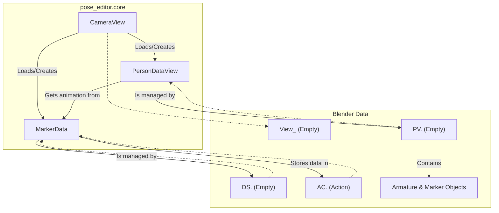

# Pose Editor Data Model

This document describes the data model and architecture for the Pose Editor add-on, focusing on how concepts are mapped to Python classes in the `pose_editor.core` package and their representation within Blender's data system.

The add-on follows an architecture where the Blender scene (`bpy.data`) is the single source of truth. Python facade classes in the `core` package provide a high-level API to interact with this data, while all direct `bpy` calls are isolated in the `blender.dal` (Data Access Layer) module.

## 1. Core Entities and Their Blender Representation

The data model is built around three main Python classes that manage different aspects of the motion capture data.

### 1.1. `core.marker_data.MarkerData`

-   **Purpose**: This class is the "Model" layer for a set of animated markers. It manages the raw animation data (locations and quality scores) for a single, continuous track (e.g., the raw output for `person_0` from `cam1`).
-   **Blender Representation**:
    -   **Data-Block**: A Blender `Action` data-block (e.g., `AC.cam1_person0_raw`). This action stores all the F-Curves for the marker animations.
    -   **Scene Object**: A corresponding Empty object (e.g., `DS.cam1_person0_raw`) is created in the `DataSeries` collection to hold metadata about the action, such as its `series_name` and the `skeleton` type it uses.
-   **Key Feature**: It uses Blender 4.4's **Slotted Actions** API. Each marker (e.g., "Nose", "LEye") gets its own `ActionSlot` within the single `Action`. The F-Curves for that marker's location and quality are then associated with that slot. This allows a single `Action` to contain the animation for an entire skeleton.

### 1.2. `core.person_data_view.PersonDataView`

-   **Purpose**: This class is the "View" layer. It creates and manages the visible Blender objects that represent a person's pose in a specific camera view.
-   **Blender Representation**:
    -   **Root Object**: A main Empty object (e.g., `PV.cam1_person0_raw`) in the `PersonViews` collection. This object acts as the parent for all visual components of this person-view.
    -   **Marker Objects**: For each joint in the skeleton, a child Empty is created. These are the objects that are ultimately animated.
    -   **Armature Object**: A child Armature object is created with bones connecting the marker objects. The bones use `COPY_LOCATION` and `STRETCH_TO` constraints to follow the markers, providing a visual representation of the skeleton's movement.
-   **Relationship**: A `PersonDataView` is connected to a `MarkerData` instance. The `apply_to_view` method on `MarkerData` assigns its `Action` to all the marker objects within the `PersonDataView`, linking the data to the visuals.

### 1.3. `core.camera_view.create_camera_view()`

-   **Purpose**: This function orchestrates the initial loading of data for a single camera. It reads all the raw JSON pose files from a directory.
-   **Process**:
    1.  Creates a main `View_<cam_name>` Empty to represent the camera view and a Blender Camera with the video as a background.
    2.  It parses all JSON files, grouping keypoints by the person index found in the files.
    3.  For each person detected (`person_0`, `person_1`, etc.), it performs the following:
        a.  Creates a `MarkerData` instance to manage the animation data, which results in a new `Action` data-block.
        b.  Populates this `Action` with all the keyframe data for that person across all frames, using the high-performance `set_fcurves_from_numpy` DAL function.
        c.  Creates a `PersonDataView` instance, which builds the visible armature and marker objects in the scene.
        d.  Connects the `PersonDataView` to the `MarkerData` instance, making the armature and markers animate.
        e.  Parents the `PersonDataView`'s root object to the main `View_<cam_name>` Empty and applies the correct scaling to transform pixel coordinates to Blender coordinates.

## 2. Slotted Actions API (Blender 4.4+)

The animation system relies on the modern "Slotted Actions" API.

-   **Structure**: A single `Action` can animate multiple objects. It contains `ActionSlots`, where each slot acts as a target for a specific object.
-   **Data Path**: An F-Curve's `data_path` within a slotted action looks like this: `slots["OBMarkerName"].location`. This tells Blender that this F-Curve drives the `location` property of the object assigned to the `OBMarkerName` slot.
-   **Assignment**: To make an object use this data, two properties must be set:
    1.  `object.animation_data.action`: Must point to the shared `Action`.
    2.  `object.animation_data.action_slot`: Must point to the specific `ActionSlot` within that action that corresponds to this object.

This model is highly efficient as it allows one `Action` to drive an entire skeleton of marker objects, rather than requiring a separate `Action` for each marker.
