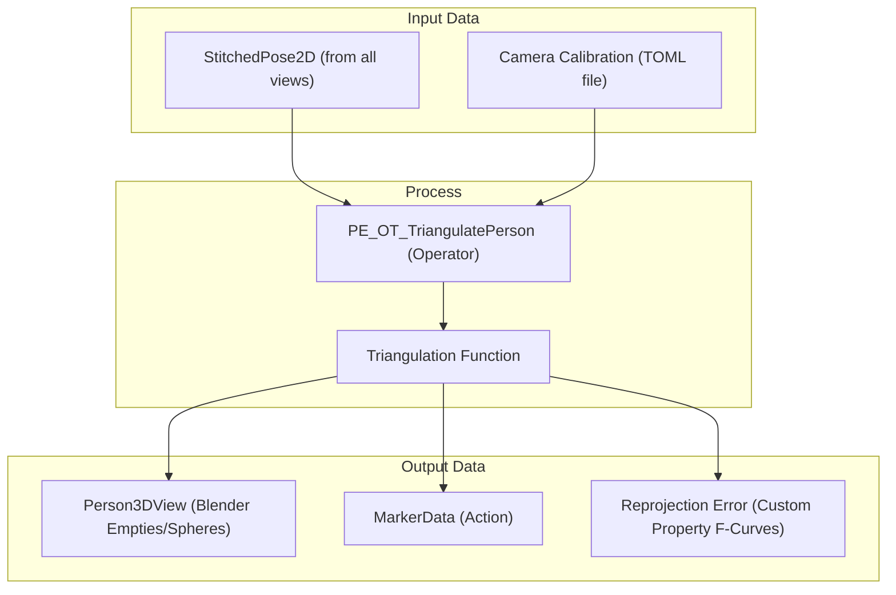

<!--
# SPDX-FileCopyrightText: 2025 Harri Kaimio
#
# SPDX-License-Identifier: BSD-3-Clause
-->
# 3D Triangulation Pipeline Design

## 1. Overview
This document outlines the design for the 3D triangulation feature. This pipeline transforms the edited 2D poses from multiple camera views into a single, animated 3D pose for each "Real Person" instance. The process relies on camera calibration data and results in a new set of 3D marker objects and a corresponding animation action.

## 2. Data Flow



## 3. Camera Calibration Management

This section details how camera calibration data is loaded, stored, and accessed within the project.

### 3.1. Data Source: TOML File Structure

The user will provide a single TOML file containing the calibration data for all cameras used in the recording. The file is structured with a separate table for each camera, following the pattern `[int_<camera_name>_img]`.

```toml
# Example Camera Calibration Data

[int_cam1_img]
name = "int_cam1_img"
size = [ 3840.0, 2160.0]
matrix = [ [ 1087.74, 0.0, 1923.35], [ 0.0, 1347.62, 1150.80], [ 0.0, 0.0, 1.0]]
distortions = [ -0.0148, 0.0104, -0.0004, -0.0114]
rotation = [ 1.6334, -0.4032, 0.3659]
translation = [ -1.7465, 0.7029, 1.6122]
fisheye = false

[int_cam2_img]
name = "int_cam2_img"
size = [ 3840.0, 2160.0]
matrix = [ [ 1823.33, 0.0, 1892.01], [ 0.0, 1802.80, 863.78], [ 0.0, 0.0, 1.0]]
distortions = [ 0.0025, -0.0008, -0.0010, 0.0009]
rotation = [ 1.5130, 0.8364, -0.2137]
translation = [ -3.8731, -0.7154, 5.3564]
fisheye = false

# ... etc. for all other cameras

[metadata]
adjusted = false
error = 0.0
```

### 3.2. Blender Data Storage

To make the `.blend` file self-contained, the calibration data will be read from the TOML file and stored directly inside the Blender scene.

- **Storage Object**: A single root-level Empty object named `_CalibrationData` will be the container for all calibration data.
- **Custom Property**: A single custom property named `calibration_data_json` will be added to the `_CalibrationData` object.
    - **Type**: `StringProperty`.
    - **Content**: This property will hold a **JSON string** representing the entire dataset parsed from the TOML file. Storing it as a single JSON string is a standard Blender practice to handle complex, nested data that doesn't fit into simple custom properties.

### 3.3. Loading Workflow and Data Access

- **User Interaction**: A "Load Calibration" button in the UI will trigger an operator.
- **Operator (`PE_OT_LoadCalibration`)**: 
    1. Opens a file browser for the user to select the calibration TOML file.
    2. Calls a core function to process the file.
- **Core Logic (`core.calibration.load_calibration_from_file`)**:
    1. Parses the selected TOML file into a Python dictionary.
    2. Converts this dictionary into a JSON string.
    3. Uses the Data Access Layer (`dal.set_custom_property`) to write this JSON string to the `calibration_data_json` property on the `_CalibrationData` empty.
- **Data Access Facade (`core.calibration.Calibration`)**: 
    - This facade class will be the application's entry point for accessing calibration data.
    - When initialized, it will use the DAL to read the `calibration_data_json` string from the `_CalibrationData` empty.
    - It will parse the JSON string into a Python dictionary and keep it in memory.
    - It will provide helper methods to easily retrieve calibration parameters for a specific camera (e.g., `get_matrix(camera_name)`).

## 4. 3D Data Representation

Analogous to the 2D `PersonDataView`, we will introduce a new `Person3DView` class to represent the 3D pose. The animation data itself will be managed by the existing `core.marker_data.MarkerData` class.

### 4.1. `core.marker_data.MarkerData` (Reused for 3D)
- **Purpose**: The generic "Model" layer for a set of animated markers. It manages a single `Action` and is capable of storing any F-Curve data.
- **3D Usage**:
    - A new `MarkerData` instance will be created for each `RealPersonInstance`'s 3D data (e.g., with series name `Alice_3D`).
    - The triangulation process will call `marker_data.set_animation_data_from_numpy()`.
    - The `columns` parameter will be configured to write to the 3D `location` (index 0, 1, 2) and to custom properties like `['reprojection_error']` and `['contributing_views']` on the marker objects.z§

### 4.2. `core.person_3d_view.Person3DView`
- **Purpose**: The "View" layer for 3D. It creates and manages the visible Blender objects for the 3D pose.
- **Blender Representation**:
    - **Root Object**: A main Empty (e.g., `PV.Alice_3D`) parented to the `RealPersonInstance`'s master Empty.
    - **Marker Objects**:
        - For skeleton joints with a 2D correspondence (`id` is not `None`): A small UV Sphere with the person's color.
        - For skeleton joints without 2D data (`id` is `None`, e.g., "Hip"): A simple Empty object (e.g., with a Cube display type).
    - **Armature**: A child Armature object connecting all marker objects (both spheres and empties) with bones, constrained to follow them.
- **Driven Markers**: The "fake" markers (Empties) will have drivers on their `location` properties. The driver expression will calculate their position based on the locations of other "real" markers (e.g., `Hip.x = (LHip.x + RHip.x) / 2`).

## 5. Triangulation Logic and Interface

### 5.1. Orchestration
- A new method will be added to the `RealPersonInstanceFacade`: `triangulate(frame_start: int, frame_end: int)`.
- **Logic**:
    1. Get the `Calibration` object.
    2. Get all `StitchedPose2D` data associated with the person instance.
    3. Create the `Person3DView` and a new `MarkerData` instance for the 3D data if they don't exist.
    4. Loop from `frame_start` to `frame_end`.
    5. In each frame, gather the 2D data (x, y, quality) for every marker from every camera view.
    6. Pass the frame's data to the core `triangulate_point` function.
    7. Collect the results (3D point, error, etc.) for all markers and frames into NumPy arrays.
    8. After the loop, call `marker_data.set_animation_data_from_numpy()` to write all collected animation data to the `Action` in one bulk operation.

### 5.2. Core Triangulation Function Interface
A pure, testable Python function will perform the core calculation for a single point in a single frame.

```python
from typing import Dict, List, NamedTuple, Optional
import numpy as np

# A placeholder for the detailed calibration structure for a single camera
class CameraCalibration:
    # This will contain matrix, distortion coeffs, etc.
    pass

class TriangulationOutput(NamedTuple):
    """The result of triangulating a single point in a single frame."""
    point_3d: np.ndarray  # Shape (3,) for (x, y, z)
    contributing_cameras: List[str]  # Names of cameras used
    reprojection_error: float

def triangulate_point(
    # Key is camera name, value is (x, y, quality)
    points_2d_by_camera: Dict[str, np.ndarray],
    # Key is camera name, value is the calibration object for that camera
    calibration_by_camera: Dict[str, CameraCalibration],
    min_cameras: int = 2,
    min_quality: float = 0.5,
) -> Optional[TriangulationOutput]:
    """
    Triangulates a single 3D point from multiple 2D observations.

    Args:
        points_2d_by_camera: A dictionary mapping camera names to their observed
                             2D point (x, y, quality) for the target marker.
        calibration_by_camera: A dictionary mapping camera names to their
                               full calibration data.
        min_cameras: The minimum number of valid cameras required to attempt
                     triangulation.
        min_quality: The minimum quality score for a 2D point to be included.

    Returns:
        A TriangulationOutput object if successful, otherwise None.
    """
    # 1. Filter out cameras with low quality scores.
    # 2. If valid cameras < min_cameras, return None.
    # 3. Perform the triangulation calculation (e.g., using OpenCV's triangulatePoints).
    # 4. Calculate the reprojection error.
    # 5. Return the results in a TriangulationOutput object.
    pass
```

## 6. User Interface and Operator

- **UI Panel**: A new "Triangulate" section will be added to the "3D Pipeline" panel.
- **Layout**:
    - A button "Triangulate Selected Persons".
    - An `EnumProperty` to choose the frame range:
        - "Current Frame"
        - "Scene Frame Range"
        - "Custom Range"
    - Two `IntProperty` fields for "Start Frame" and "End Frame", which are only visible when "Custom Range" is selected.
- **Operator (`PE_OT_TriangulatePerson`)**:
    - `bl_idname`: `pose_editor.triangulate_person`
    - `bl_label`: "Triangulate Person(s)"
    - **`execute()` method**:
        1. Determines the `start_frame` and `end_frame` based on the UI settings.
        2. Gets the selected `RealPersonInstance` objects from `context.selected_objects`.
        3. For each selected object, creates a `RealPersonInstanceFacade`.
        4. Calls `facade.triangulate(frame_start=start_frame, frame_end=end_frame)`.
        5. Reports success to the user.

## 7. Phased Implementation Plan

This feature will be implemented in verifiable phases to ensure stability and correctness at each step.

### Phase 1: Calibration Data Handling
- **Goal**: Implement the loading, storage, and access of camera calibration data.
- **Tasks**:
    1. Implement the `PE_OT_LoadCalibration` operator and its corresponding UI button.
    2. Create the `core.calibration` module with the `Calibration` facade.
    3. Implement the logic to parse the TOML file, convert it to a JSON string, and store it in a custom property on the `_CalibrationData` empty via the DAL.
- **Verification**: Can be tested independently. An integration test will run the operator and then verify that the `Calibration` facade can be instantiated and correctly retrieve data (e.g., `get_matrix("int_cam1_img")`).
- **Dependencies**: None.
- **Inputs**: Requires the `calib_example.toml` file for testing.

### Phase 2: 3D Data Structure Creation
- **Goal**: Create the visible Blender objects that represent the 3D pose (the `Person3DView`).
- **Tasks**:
    1. Create the `core.person_3d_view` module and the `Person3DView` class.
    2. Implement the creation of the object hierarchy: a root empty, marker spheres (for real joints), marker empties (for virtual joints), and the connecting armature with constraints.
    3. Implement the creation of drivers for the virtual markers (e.g., "Hip").
- **Verification**: Can be tested by creating a `RealPersonInstance` and instantiating a `Person3DView` for it. The test will assert that the correct objects, hierarchy, and drivers are created in the Blender scene.
- **Dependencies**: A `RealPersonInstance` must exist in the scene.

### Phase 3: 3D Animation Data Management
- **Goal**: Create and populate the `MarkerData` action for the 3D animation.
- **Tasks**:
    1. In the triangulation logic (Phase 4), call `MarkerData.create_new()` to create a new data series for the 3D data (e.g., "Alice_3D").
    2. Connect the new `MarkerData` instance to the `Person3DView` instance created in Phase 2.
    3. The triangulation orchestrator will be responsible for formatting the NumPy array of 3D points and metadata into the `columns` structure expected by `set_animation_data_from_numpy`.
- **Verification**: This will be verified as part of the end-to-end test in Phase 4. The test will check that the correct `Action` is created and populated with F-Curves for the 3D location and metadata.
- **Dependencies**: Phase 2.

### Phase 4: Triangulation Core and Operator
- **Goal**: Implement the main triangulation logic and the user-facing operator.
- **Tasks**:
    1. Implement the pure Python `triangulate_point` function, integrating the user-provided draft logic.
    2. Implement the orchestrator method `triangulate(start, end)` on the `RealPersonInstanceFacade`.
    3. Implement the `PE_OT_TriangulatePerson` operator and its UI.
- **Verification**: This is the final end-to-end test. It will involve a full scene setup with 2D data, running the operator, and asserting that the `MarkerData` action is populated with correctly triangulated 3D coordinates and metadata.
- **Dependencies**: Phases 1, 2, and 3.
- **Inputs**: Requires the draft triangulation function and a complete test dataset (2D poses from multiple cameras + calibration file).
