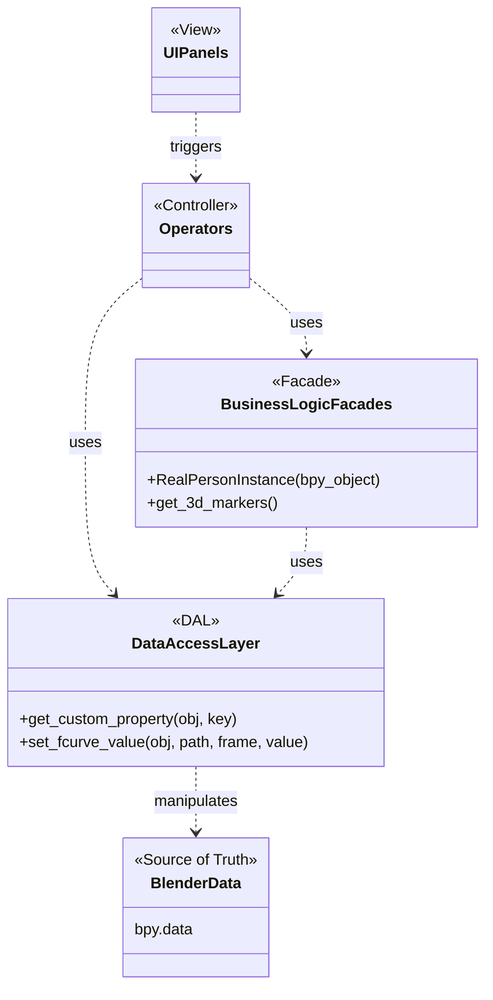

# Implementation Architecture

This document describes the proposed Python class structure and overall architecture for the Pose Editor add-on. The design emphasizes separation of concerns, maintainability, and unit testability.

## 1. High-Level Architecture: Blender as the Source of Truth

Per our discussion, we will adopt an architecture where the Blender scene (`bpy.data`) serves as the single source of truth. This is a robust, idiomatic approach for Blender add-ons that avoids complex data synchronization issues.

The layers are now defined as follows:

-   **Blender Data (Source of Truth):** All persistent data, such as marker positions, object relationships, and project settings, resides directly in the `.blend` file on `bpy.data` objects (e.g., as custom properties on Empties).

-   **Data Access Layer (DAL):** A thin, dedicated module that is the *only* part of the add-on allowed to make direct `bpy.data` calls (e.g., `obj.get("my_prop")`, `obj.location`). This layer provides simple, abstract functions for getting and setting data. Crucially, it can be easily mocked for unit testing the layers above it.

-   **Business Logic / Facades (Model):** This layer contains the application's intelligence. The classes here (`RealPersonInstance`, `CameraView`) are lightweight, often transient wrappers that are initialized with a Blender object (like an Empty). They use the DAL to get or set data and perform operations. They contain the business logic (e.g., "how to triangulate") but do not know how the data is stored in Blender.

-   **Operators & UI (Controller & View):** This layer remains the same. Operators handle user actions, using the Facade classes to work with the data. UI Panels read data (via the Facades) to draw themselves.



## 2. Proposed Directory Structure

The directory structure is updated to reflect this new architecture.

```
pose_editor/
|-- __init__.py           # Main add-on registration
|-- core/                 # Business Logic / Facades
|   |-- __init__.py
|   |-- project_facade.py
|   `-- person_facade.py
|-- blender/              # Blender-specific code
|   |-- __init__.py
|   |-- dal.py            # The Data Access Layer
|   |-- scene_builder.py  # For initial object creation
|   |-- operators.py      # All bpy.types.Operator classes
|   `-- properties.py       # Blender PropertyGroup definitions
`-- ui/                   # UI Panels
    |-- __init__.py
    `-- panels.py
```

## 3. Data Access Layer (DAL)
This is a new, critical layer located at `blender/dal.py`. It abstracts all `bpy` interactions into simple, testable functions.

```python
# blender/dal.py

# This module contains all direct access to bpy.data

def get_root_project_empty() -> bpy.types.Object:
    # Logic to find and return the main project empty
    pass

def get_custom_property(blender_object: bpy.types.Object, key: str, default: any) -> any:
    return blender_object.get(key, default)

def set_custom_property(blender_object: bpy.types.Object, key: str, value: any) -> None:
    blender_object[key] = value

def get_marker_world_location(marker_object: bpy.types.Object, frame: int) -> tuple[float, float, float]:
    # Logic to get f-curve value at a specific frame
    pass

# ... and so on for every other bpy.data interaction.
```

## 4. Business Logic / Facades
These classes in the `core/` directory provide the main API for the rest of the application to use. They are initialized with a Blender object but perform all their internal data access via the DAL.

```python
# core/person_facade.py

# Note: No 'import bpy' here!
from ..blender import dal

class RealPersonInstanceFacade:
    """A lightweight wrapper around a person's master Empty object."""

    def __init__(self, person_instance_empty):
        # In production, this is a bpy.types.Object.
        # In testing, this can be a mock object or a simple dict.
        self.bl_obj = person_instance_empty

    @property
    def name(self) -> str:
        return dal.get_custom_property(self.bl_obj, 'person_definition_id', "")

    def get_3d_marker_data_as_numpy(self) -> 'numpy.ndarray':
        """Gets all 3D marker data for this person."""
        marker_objects = dal.get_children_in_collection(self.bl_obj, "3D Markers")
        # ... logic to iterate through frames and markers, using the DAL
        # to get locations for each frame, and assemble a numpy array.
        pass
```

## 5. Operators and UI
Operators now use the Facades to interact with the data, keeping the operator logic clean and focused on orchestration.

```python
# blender/operators.py

import bpy
from ..core.person_facade import RealPersonInstanceFacade
from ..blender import dal

class PE_OT_triangulate(bpy.types.Operator):
    bl_idname = "pose.triangulate"
    bl_label = "Triangulate Persons"

    def execute(self, context):
        # 1. Get selected Blender objects from the context
        selected_empties = context.selected_objects

        for empty in selected_empties:
            # 2. Create a facade for the person instance
            person_facade = RealPersonInstanceFacade(empty)

            # 3. Use the facade to perform the core logic
            # The facade itself uses the DAL internally
            numpy_data_2d = person_facade.get_all_2d_marker_data()
            
            # This function can be pure Python and easily tested
            triangulated_data = self.perform_triangulation(numpy_data_2d)

            # 4. Use the DAL to write the results back to Blender
            dal.create_or_update_3d_markers(empty, triangulated_data)

        return {'FINISHED'}

    def perform_triangulation(self, data):
        # Pure, testable logic that might call Pose2Sim
        pass
```