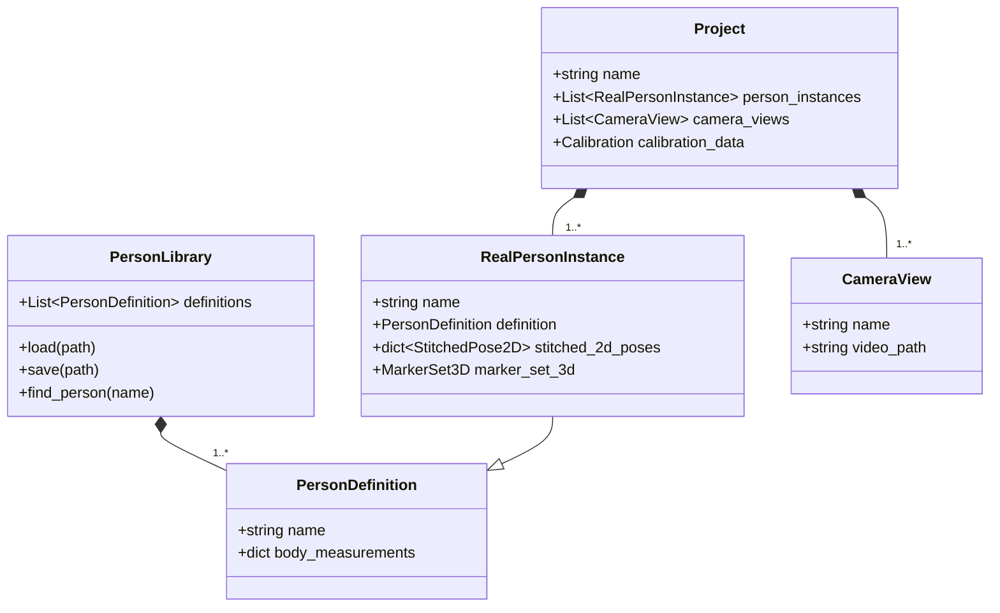

# Implementation Architecture

This document describes the proposed Python class structure and overall architecture for the Pose Editor add-on. The design emphasizes separation of concerns, maintainability, and unit testability.

## 1. High-Level Architecture

The add-on will follow a layered architecture, loosely based on the Model-View-Controller (MVC) pattern, adapted for the Blender environment. This separates the core data and logic from the user interface and the Blender scene representation.

-   **Model (Core Layer):** Pure Python classes that represent the application's data and business logic. This layer has no dependency on Blender's `bpy` module and is therefore fully unit-testable.
-   **Scene/Blender Layer (Controller):** This layer acts as the bridge between the core Model and Blender. It consists of two main parts:
    -   **Scene Manager:** A module responsible for all direct manipulation of the Blender scene (creating objects, collections, custom properties).
    -   **Operators:** Blender Operators that respond to UI events. They orchestrate the flow of data, calling the Model to update its state and the Scene Manager to reflect those state changes in the viewport.
-   **UI Layer (View):** Standard Blender UI panels (`bpy.types.Panel`) that draw the user interface. They read data (managed by the Controller) and present it to the user.

```mermaid
graph TD
    subgraph User Interaction
        A[UI Panels (View)];
    end

    subgraph Blender-Specific Logic
        B[Operators (Controller)];
        C[Scene Manager (Controller)];
    end

    subgraph Pure Python Core
        D[Data Model & Logic (Model)];
    end

    A -- "Triggers" --> B;
    B -- "Updates" --> D;
    B -- "Commands" --> C;
    C -- "Reads from" --> D;
```

## 2. Proposed Directory Structure

To enforce this separation, the add-on's code will be organized as follows:

```
pose_editor/
|-- __init__.py       # Main add-on registration
|-- core/             # Layer 1: Model
|   |-- __init__.py
|   |-- project.py      # Project, CameraView, etc.
|   |-- person.py       # PersonDefinition, PersonLibrary
|   |-- triangulation.py# Interface with Pose2Sim
|   `-- filtering.py    # Interface with Pose2Sim
|-- blender/          # Layer 2: Controller
|   |-- __init__.py
|   |-- scene.py        # SceneManager: creates/updates Blender objects
|   |-- operators.py    # All bpy.types.Operator classes
|   `-- properties.py   # Blender PropertyGroup definitions
`-- ui/               # Layer 3: View
    |-- __init__.py
    |-- panels.py       # All bpy.types.Panel classes
    `-- menus.py        # bpy.types.Menu classes
```

## 3. Layer 1: Core Data Model & Logic
This layer is pure Python. It knows nothing about Blender.

### 3.1. Class Diagram



### 3.2. Class Interfaces (Python Snippets)

```python
# core/person.py

class PersonDefinition:
    """Stores the reusable data for a unique individual."""
    name: str
    body_measurements: dict[str, float]

class PersonLibrary:
    """Manages the collection of all known PersonDefinitions."""
    def load_from_disk(self, file_path: str) -> None:
        pass

    def save_to_disk(self, file_path: str) -> None:
        pass

    def add_person_definition(self, name: str) -> PersonDefinition:
        pass

# core/project.py

class RealPersonInstance:
    """Represents a person within a specific project."""
    definition: PersonDefinition
    # ... other project-specific data

class Project:
    """The main data container for the entire application state."""
    name: str
    person_instances: list[RealPersonInstance]
    camera_views: list # ... and so on

    def add_person_from_library(self, definition: PersonDefinition) -> RealPersonInstance:
        pass
```

## 4. Layer 2: Blender Scene & Operators (Controller)
This layer translates the pure Python data model into Blender objects and handles user actions.

### 4.1. Scene Manager
The `blender/scene.py` module will be responsible for all `bpy` calls that modify scene data. This isolates mutation logic and makes it easier to debug.

```python
# blender/scene.py

from pose_editor.core import project

def create_project_structure(proj: project.Project) -> None:
    """Creates the main collections for the project."""
    pass

def create_person_instance_objects(person_instance: project.RealPersonInstance) -> None:
    """Creates the master Empty and collections for a person instance."""
    # 1. Create the master Empty
    # 2. Set custom properties on the Empty (e.g., person_definition_id)
    # 3. Create sub-collections for 3D markers and the final armature
    pass

def sync_3d_markers_to_scene(person_instance: project.RealPersonInstance) -> None:
    """Creates or updates Blender Empties to match the 3D marker data."""
    pass
```

### 4.2. Operators
Operators in `blender/operators.py` contain the logic for user actions. They follow a clear pattern: `Modify Model -> Update Scene`.

```python
# blender/operators.py

import bpy
from pose_editor.core.project import Project
from pose_editor.blender import scene

# A global instance of our project data model
# This would be managed by the add-on registration logic
project_data = Project()

class PE_OT_triangulate(bpy.types.Operator):
    bl_idname = "pose.triangulate"
    bl_label = "Triangulate Persons"

    def execute(self, context):
        # 1. Get selected persons from the UI/context
        selected_person_names = get_selected_persons_from_context(context)

        # 2. Call the CORE/MODEL layer to perform the logic
        # (This is a hypothetical function)
        for name in selected_person_names:
            person_instance = project_data.get_person_by_name(name)
            triangulate_person(person_instance) # This would call Pose2Sim

        # 3. Call the SCENE layer to update Blender
        for name in selected_person_names:
            person_instance = project_data.get_person_by_name(name)
            scene.sync_3d_markers_to_scene(person_instance)

        return {'FINISHED'}
```

## 5. Layer 3: UI Panels (View)
The UI panels in `ui/panels.py` are responsible only for drawing. They read from the project data model (or Blender properties that are synced to it) and display it.

```python
# ui/panels.py

import bpy

class PE_PT_3d_pipeline(bpy.types.Panel):
    bl_label = "3D Pipeline"
    # ... other panel settings

    def draw(self, context):
        layout = self.layout
        # Assume project_data is accessible
        from .operators import project_data

        # Draw the list of real persons
        box = layout.box()
        box.label(text="Process Real Persons:")
        for person in project_data.person_instances:
            row = box.row()
            row.prop(person, "is_selected") # Assumes a BoolProperty
            row.label(text=person.name)

        # Draw the operator button
        layout.operator(PE_OT_triangulate.bl_idname)
```
