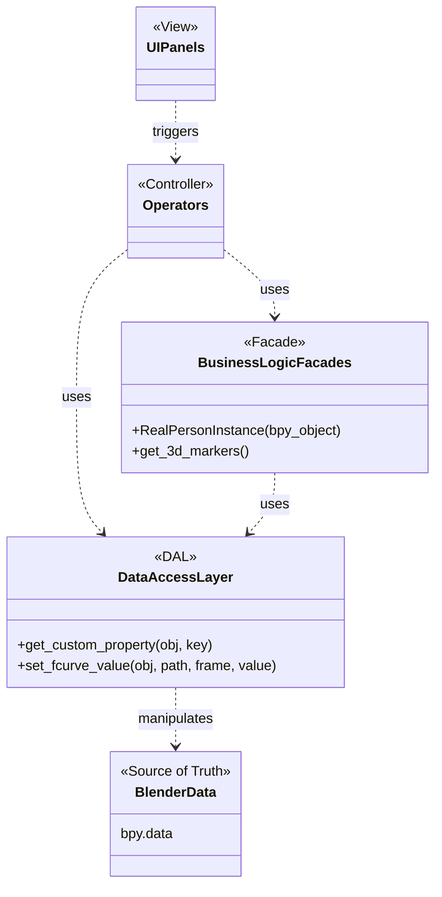

<!--
SPDX-FileCopyrightText: 2025 Harri Kaimio

SPDX-License-Identifier: BSD-3-Clause
-->

# Implementation Architecture

This document describes the proposed Python class structure and overall architecture for the Pose Editor add-on. The design emphasizes separation of concerns, maintainability, and unit testability.

## 1. High-Level Architecture: Blender as the Source of Truth

Per our discussion, we will adopt an architecture where the Blender scene (`bpy.data`) serves as the single source of truth. This is a robust, idiomatic approach for Blender add-ons that avoids complex data synchronization issues.

The layers are now defined as follows:

-   **Blender Data (Source of Truth):** All persistent data, such as marker positions, object relationships, and project settings, resides directly in the `.blend` file on `bpy.data` objects (e.g., as custom properties on Empties).

-   **Data Access Layer (DAL):** A thin, dedicated module that is the *only* part of the add-on allowed to make direct `bpy.data` calls (e.g., `obj.get("my_prop")`, `obj.location`). This layer provides simple, abstract functions for getting and setting data. Crucially, it can be easily mocked for unit testing the layers above it.

-   **Business Logic / Facades (Model):** This layer contains the application's intelligence. The classes here (`RealPersonInstance`, `CameraView`) are lightweight, often transient wrappers that are initialized with a Blender object (like an Empty). They use the DAL to get or set data and perform operations. They contain the business logic (e.g., "how to triangulate") but do not know how the data is stored in Blender.

-   **Operators & UI (Controller & View):** This layer remains the same. Operators handle user actions, using the Facade classes to work with the data. UI Panels read data (via the Facades) to draw themselves.



## 2. Proposed Directory Structure

The directory structure is updated to reflect this new architecture.

```
pose_editor/
|-- __init__.py           # Main add-on registration
|-- core/                 # Business Logic / Facades
|   |-- __init__.py
|   |-- project_facade.py
|   `-- person_facade.py
|-- blender/              # Blender-specific code
|   |-- __init__.py
|   |-- dal.py            # The Data Access Layer
|   |-- scene_builder.py  # For initial object creation
|   |-- operators.py      # All bpy.types.Operator classes
|   `-- properties.py       # Blender PropertyGroup definitions
`-- ui/                   # UI Panels
    |-- __init__.py
    `-- panels.py
```

## 3. Data Access Layer (DAL)
This is a new, critical layer located at `blender/dal.py`. It abstracts all `bpy` interactions into simple, testable functions.

```python
# blender/dal.py

# This module contains all direct access to bpy.data

def get_root_project_empty() -> bpy.types.Object:
    # Logic to find and return the main project empty
    pass

def get_custom_property(blender_object: bpy.types.Object, key: str, default: any) -> any:
    return blender_object.get(key, default)

def set_custom_property(blender_object: bpy.types.Object, key: str, value: any) -> None:
    blender_object[key] = value

def get_marker_world_location(marker_object: bpy.types.Object, frame: int) -> tuple[float, float, float]:
    # Logic to get f-curve value at a specific frame
    pass

# ... and so on for every other bpy.data interaction.
```

## 4. Business Logic / Facades
These classes in the `core/` directory provide the main API for the rest of the application to use. They are initialized with a Blender object but perform all their internal data access via the DAL.

```python
# core/person_facade.py

# Note: No 'import bpy' here!
from ..blender import dal

class RealPersonInstanceFacade:
    """A lightweight wrapper around a person's master Empty object."""

    def __init__(self, person_instance_empty):
        # In production, this is a bpy.types.Object.
        # In testing, this can be a mock object or a simple dict.
        self.bl_obj = person_instance_empty

    @property
    def name(self) -> str:
        return dal.get_custom_property(self.bl_obj, 'person_definition_id', "")

    def get_3d_marker_data_as_numpy(self) -> 'numpy.ndarray':
        """Gets all 3D marker data for this person."""
        marker_objects = dal.get_children_in_collection(self.bl_obj, "3D Markers")
        # ... logic to iterate through frames and markers, using the DAL
        # to get locations for each frame, and assemble a numpy array.
        pass
```

### 4.1. Skeleton Handling
The `core/skeleton.py` module defines classes for managing different skeleton definitions and their associated joint data.

-   **`SkeletonBase`**: This is the base class for all skeleton types. It encapsulates an `anytree.Node` structure representing the hierarchical definition of a skeleton. It provides common methods for querying joint information, such as:
    -   `get_joint_name(joint_id: int) -> str | None`: Retrieves the name of a joint given its ID.
    -   `get_joint_id(joint_name: str) -> int | None`: Retrieves the ID of a joint given its name.
    -   `calculate_fake_marker_pos(name: str, marker_data: Dict[str, List[float]]) -> List[float] | None`: A placeholder method intended to calculate positions for "fake" or derived markers that are not directly provided by the raw pose data.

-   **`COCO133Skeleton`**: This class extends `SkeletonBase` to provide specific implementations for the `COCO_133` skeleton definition. It overrides the `calculate_fake_marker_pos` method to compute the positions of "Hip" and "Neck" markers, which are often not directly provided by pose estimation models for this skeleton.
    -   The "Hip" marker position is calculated as the midpoint between the "RHip" and "LHip" markers.
    -   The "Neck" marker position is calculated as the midpoint between the "RShoulder" and "LShoulder" markers.
    This method is designed to work with both 2D (x, y, likelihood) and 3D (x, y, z) marker data.


## 5. Operators and UI
Operators now use the Facades to interact with the data, keeping the operator logic clean and focused on orchestration.

```python
# blender/operators.py

import bpy
from ..core.person_facade import RealPersonInstanceFacade
from ..blender import dal

class PE_OT_triangulate(bpy.types.Operator):
    bl_idname = "pose.triangulate"
    bl_label = "Triangulate Persons"

    def execute(self, context):
        # 1. Get selected Blender objects from the context
        selected_empties = context.selected_objects

        for empty in selected_empties:
            # 2. Create a facade for the person instance
            person_facade = RealPersonInstanceFacade(empty)

            # 3. Use the facade to perform the core logic
            # The facade itself uses the DAL internally
            numpy_data_2d = person_facade.get_all_2d_marker_data()
            
            # This function can be pure Python and easily tested
            triangulated_data = self.perform_triangulation(numpy_data_2d)

            # 4. Use the DAL to write the results back to Blender
            dal.create_or_update_3d_markers(empty, triangulated_data)

        return {'FINISHED'}

    def perform_triangulation(self, data):
        # Pure, testable logic that might call Pose2Sim
        pass
```
## 6. Initial Workflow Implementation Details
This chapter details the implementation flow for the initial setup and 2D stitching phases of the add-on, showing how the different architectural layers interact.

### 6.1. Project Initialization
-   **Use Case:** The user needs to set up the basic collection structure in a new `.blend` file to begin work.
-   **User Interaction:** The user clicks the "Create New Project" button in the Project Setup UI panel.
-   **Sequence Diagram:**
    ```mermaid
    sequenceDiagram
        actor User
        User->>UI Panel: Clicks 'Create New Project'
        UI Panel->>Operator (PE_OT_CreateProject): execute()
        Operator (PE_OT_CreateProject)->>Scene Builder: create_project_structure()
        Scene Builder->>DAL: create_collection("Camera Views")
        Scene Builder->>DAL: create_collection("Real Persons")
        Scene Builder->>DAL: create_empty("_ProjectSettings")
    ```
-   **Interfaces:**
    -   `ui.panels.PE_PT_ProjectPanel`: Draws the button.
    -   `blender.operators.PE_OT_CreateProject`: The operator that responds to the button click.
    -   `blender.scene_builder.create_project_structure()`: Contains the logic to build the initial scene hierarchy.
    -   `blender.dal`: Various functions to create collections and objects.

### 6.2. Loading a Camera View
-   **Use Case:** The user adds a camera view, loading its video and raw pose data.
-   **User Interaction:** Clicks "Add Camera View", which opens a file browser. The user selects the video file and the directory containing the corresponding pose data JSONs.
-   **Sequence Diagram:**
    ```mermaid
    sequenceDiagram
        actor User
        User->>UI Panel: Clicks 'Add Camera View'
        UI Panel->>Operator (PE_OT_AddCameraView): invoke() -> opens file browser
        Operator (PE_OT_AddCameraView)->>Core (camera_view.py): create_camera_view(name, video, pose_dir, skeleton)
        Core (camera_view.py)->>DAL: create_empty("View: <name>")
        Core (camera_view.py)->>DAL: set_custom_property(view_empty, SERIES_NAME, name)
        Note right of Core (camera_view.py): Calculates coordinate transformation factors
        Core (camera_view.py)->>DAL: set_custom_property(view_empty, "camera_x_factor", ...)
        Note right of Core (camera_view.py): Loads and parses all raw pose data JSONs from the directory.
        loop for each detected person
            Core (camera_view.py)->>DAL: create_empty("<name>_Person<idx>")
            Note right of Core (camera_view.py): Applies coordinate transformation to person empty's scale and location
            Core (camera_view.py)->>DAL: set_custom_property(person_empty, SERIES_NAME, ...)
            loop for each marker in skeleton
                Core (camera_view.py)->>DAL: create_marker(...)
                Note right of Core (camera_view.py): Adds keyframes with RAW pixel coordinates
                Core (camera_view.py)->>DAL: add_keyframe(...)
            end
        end
    ```
-   **Interfaces:**
    -   `blender.operators.PE_OT_AddCameraView`: Has an `invoke` method for the file browser and an `execute` method to trigger the process.
    -   `core.camera_view.create_camera_view()`: Orchestrates the creation of all necessary objects and data processing for a view.
    -   `blender.dal`: Various functions for creating objects, setting custom properties, and keyframing.

### 6.2.1. Raw Pose Data Format and Blender Mapping
This section details the structure of the raw 2D pose data JSON files and how this data is mapped to Blender objects and properties.

**JSON File Format (Example: `cam1_000000.json`)**
Each JSON file represents a single frame and contains data for one or more persons.
```json
{
  "version": 1.3,
  "people": [
    {
      "person_id": [-1],
      "pose_keypoints_2d": [
        // x1, y1, likelihood1, x2, y2, likelihood2, ...
      ]
    },
    // ... more person objects
  ]
}
```

**Mapping to Blender Data**

The raw 2D pose data is mapped to Blender objects and their properties as follows:

-   **Camera View Object:** A top-level Blender Empty object is created for each camera view (e.g., `View_cam_01`). This empty is identified by a `SERIES_NAME` custom property holding the camera view's name.
-   **Raw Person Data Object:** For each person detected in the raw data, a Blender Empty object is created as a child of the Camera View object (e.g., `cam1_Person0`). This empty is identified by its own `SERIES_NAME` custom property. The coordinate transformation from video space to Blender space is applied directly to the `scale` and `location` of this object.
-   **Marker Spheres:** For each marker defined in the chosen skeleton, a small UV sphere is created as a child of the Raw Person Data object.
    -   **Location:** The raw, untransformed `X` and `Y` pixel coordinates from `pose_keypoints_2d` are stored directly as F-curves on the marker sphere's `location.x` and `location.y` properties. The `Z` coordinate is set to 0.
    -   **Quality (Likelihood):** The `Likelihood` value is stored as an F-curve on a custom property named `"quality"` on the marker sphere, which in turn drives the marker's material color for visual feedback.

### 6.2.2. Coordinate Transformation
To correctly display the 2D pixel coordinates (origin top-left, Y-down) in Blender's 3D coordinate system (origin center, Y-up), a non-destructive transformation is applied to the parent object of the markers (the Raw Person Data Object).

This is achieved by setting the `scale` and `location` of the parent object. The original pixel coordinates remain unchanged in the markers' F-curves.

The transformation factors are calculated as follows and stored as custom properties on the main Camera View Object for reference:

-   **`camera_x_factor` (float):** The scaling factor for the X-axis.
-   **`camera_y_factor` (float):** The scaling factor for the Y-axis (this is negative to invert the axis).
-   **`camera_x_offset` (float):** The offset for the X-axis.
-   **`camera_y_offset` (float):** The offset for the Y-axis.

**Transformation Logic:**
1.  The `scale` of the Raw Person Data Object is set to `(camera_x_factor, camera_y_factor, 1)`.
2.  The `location` of the Raw Person Data Object is set to `(camera_x_offset, camera_y_offset, 0)`.

**Skeleton Definition (`pose2sim/Pose2Sim/skeletons.py`)**
The `pose_keypoints_2d` array's structure is determined by the chosen skeleton. For example, the `HALPE_26` skeleton defines the order and meaning of each `[X, Y, Likelihood]` triplet. The `id` attribute of each `anytree.Node` in the skeleton directly corresponds to its 0-based index in the `pose_keypoints_2d` array.

### 6.3. Creating a Real Person Instance
-   **Use Case:** The user adds a person to the project, either by creating a new reusable definition or by selecting an existing one from the library.
-   **User Interaction:** Clicks "Add Person Instance". A popup dialog appears, allowing the user to select from a dropdown of existing `PersonDefinition`s or enter a new name to create a new one.
-   **Sequence Diagram:**
    ```mermaid
    sequenceDiagram
        actor User
        User->>UI Panel: Clicks 'Add Person Instance'
        UI Panel->>Operator (PE_OT_AddPersonInstance): invoke() -> opens popup
        Operator (PE_OT_AddPersonInstance)->>Core Library: person_library.load_from_disk()
        Note right of Operator (PE_OT_AddPersonInstance): Operator populates UI with person names
        User->>Operator (PE_OT_AddPersonInstance): Selects person (e.g. 'Alice')
        Operator (PE_OT_AddPersonInstance)->>Scene Builder: create_person_instance('Alice')
        Scene Builder->>DAL: create_empty("Alice")
        Scene Builder->>DAL: set_custom_property(empty, "person_definition_id", "Alice")
    ```
-   **Interfaces:**
    -   `blender.operators.PE_OT_AddPersonInstance`: Manages the popup dialog and selection.
    -   `core.person.PersonLibrary`: Methods to load, find, and create `PersonDefinition`s.
    -   `blender.scene_builder.create_person_instance()`: Creates the Blender objects for the new instance.

### 6.4. Creating a Real Person Instance
-   **Use Case:** The user adds a person to the project, either by creating a new reusable definition or by selecting an existing one from the library.
-   **User Interaction:** Clicks "Add Person Instance". A popup dialog appears, allowing the user to select from a dropdown of existing `PersonDefinition`s or enter a new name to create a new one.
-   **Sequence Diagram:**
    ```mermaid
    sequenceDiagram
        actor User
        User->>UI Panel: Clicks 'Add Person Instance'
        UI Panel->>Operator (PE_OT_AddPersonInstance): invoke() -> opens popup
        Operator (PE_OT_AddPersonInstance)->>Core Library: person_library.load_from_disk()
        Note right of Operator (PE_OT_AddPersonInstance): Operator populates UI with person names
        User->>Operator (PE_OT_AddPersonInstance): Selects person (e.g. 'Alice')
        Operator (PE_OT_AddPersonInstance)->>Scene Builder: create_person_instance('Alice')
        Scene Builder->>DAL: create_empty("Alice")
        Scene Builder->>DAL: set_custom_property(empty, "person_definition_id", "Alice")
    ```
-   **Interfaces:**
    -   `blender.operators.PE_OT_AddPersonInstance`: Manages the popup dialog and selection.
    -   `core.person.PersonLibrary`: Methods to load, find, and create `PersonDefinition`s.
    -   `blender.scene_builder.create_person_instance()`: Creates the Blender objects for the new instance.

### 6.5. 2D Identity Stitching
-   **Use Case:** The user needs to create a single, continuous, and editable 2D pose timeline for a "Real Person" by combining segments from various raw, fragmented tracks that were automatically detected.

-   **Mechanism (Destructive Copy with Keyframed Index):** The workflow combines a non-destructive index with a destructive copy. A keyframed integer property, `active_track_index`, is stored on the `RealPersonInstance`'s data object for each camera view. This property's keyframes define the "seams" or switch points between source tracks. When a user assigns a new source track at a specific frame, the operator performs a destructive copy of the animation data from the source to the target, but only for the duration of that segment (from the current frame to the next keyframe on `active_track_index`). This results in a fully editable timeline while retaining a non-destructive record of the stitch points.

-   **Blender Data Representation:**
    -   **Source:** A `MarkerData` object representing a raw track (e.g., `MD.cam1_person0`). Its animation is stored in the corresponding `Action` (e.g., `AC.cam1_person0`).
    -   **Target:** A `MarkerData` object representing a specific view of a `RealPersonInstance` (e.g., `MD.Alice.cam1`). Its animation is stored in its own `Action` (e.g., `AC.Alice.cam1`).
    -   **Stitch Index:** A custom property `active_track_index` (integer) is added to the target's data-series Empty (`DS.Alice.cam1`). This property is animated with keyframes. The value at any given frame indicates which raw person index (e.g., 0, 1, 2) is the source for that frame.

-   **UI and User Interaction:**
    1.  The UI panel for stitching is located in the 3D View sidebar.
    2.  The panel automatically determines the **active camera view** based on the user's current 3D viewport.
    3.  It lists all `RealPersonInstance`s in the scene.
    4.  For each `RealPersonInstance`, it displays a dropdown menu (`EnumProperty`) listing all available raw tracks for the active view (e.g., "Person 0", "Person 1"). The dropdown shows the current source track for the active frame.
    5.  A single button, **"Assign Source at Current Frame"**, triggers the operation for all persons whose dropdown selection has been changed.

-   **Operator Logic (`PE_OT_AssignTrack`):**
    1.  The operator is called. It gets the current frame from the scene.
    2.  It identifies the active camera view.
    3.  It iterates through the `RealPersonInstance`s and their corresponding UI dropdowns.
    4.  For each person where the selected raw track has changed:
        a.  It reads the `active_track_index` F-curve for that person to find the frame number of the *next* keyframe after the current one. This determines the `end_frame` of the segment to be copied. If no future keyframe exists, the scene's end frame is used.
        b.  It inserts a new keyframe on the `active_track_index` property at the `current_frame`, setting its value to the index of the newly selected raw track.
        c.  It calls a core logic function to copy the animation data from the source `MarkerData` Action to the target `RealPersonInstance`'s `MarkerData` Action, for the range `[current_frame, end_frame]`.

-   **Interfaces:**
    -   `ui.panels.PE_PT_StitchingPanel`: A new panel with a custom `draw()` method to dynamically display rows for each `RealPersonInstance` and their corresponding `EnumProperty` dropdowns.
    -   `blender.properties.StitchingPropertyGroup`: A `PropertyGroup` to hold the collection of `EnumProperty` items for the UI.
    -   `blender.operators.PE_OT_AssignTrack`: The operator that contains the main logic described above.
    -   `core.person_facade.RealPersonInstanceFacade`: Methods to get/set the `active_track_index` keyframes and to perform the animation copy between `MarkerData` objects.
    -   `blender.dal`: Functions to read F-curve keyframes within a range (`get_fcurves_from_action`) and write them (`set_fcurves_from_numpy`).

#### Stitching implementation  plan

  First, I'll define the necessary PropertyGroup to store the UI state. This will involve creating a group to hold the dropdown selection for a
  single person and then a CollectionProperty to manage a list of these groups, one for each "Real Person".


   * Deliverable: A new file src/pose_editor/blender/properties.py with the required PropertyGroup classes.
  Step 2: Implement the Core Stitching Logic (in person_facade.py)
   * Deliverable:
  Step 3: Implement the UI Panel (in panels.py)
   * Deliverable: A new PE_PT_StitchingPanel class. Its draw method will be responsible for:
   * Deliverable: A new PE_OT_AssignTrack operator. When executed, it will:
  This step-by-step approach ensures that each part of the feature is built on a tested and verified foundation, making the whole process more
  robust and manageable.

Step 4: Complete the Core Logic (in person_facade.py)
  The RealPersonInstanceFacade is the brain of this operation. I will fully implement the methods we sketched out earlier.


   * `get_active_track_index_at_frame(view_name, frame)`: This method will find the active_track_index F-curve on the person's data object for the
     specified view and evaluate its value at the given frame. This tells us which raw track is currently the source.
  The PE_OT_AssignTrack operator will be the bridge between the UI and the core logic.


   * I will replace the placeholder code in its execute method with the following logic:
   * The get_available_tracks function in properties.py will be properly implemented to inspect the scene, find the raw tracks associated with the
     active camera view, and return them as a list for the dropdown menu.
  By completing these three steps, the entire feature will be functional, from the user interface to the underlying data manipulation.

  The actual data copying will happen in two main places, following the architectural layers we've established:

   1. The Orchestration (The "How"): The logic for the copy operation will be orchestrated inside the `assign_source_track_for_segment` method of
      the `RealPersonInstanceFacade` class (in src/pose_editor/core/person_facade.py). This method will be responsible for:
   2. The Execution (The "Do"): The low-level reading and writing of the animation data will be handled by functions in the Data Access Layer
      (src/pose_editor/blender/dal.py). Specifically:
  So, in short: the facade decides what to copy and where, and the DAL performs the actual, optimized copy operation within Blender's data.

The copying must be done at the keyframe level, not by sampling the evaluated curve.

Here is the corrected and more precise plan for where the copying will happen:

##### The Corrected Data Copying Plan

The data copying will still be orchestrated by the `assign_source_track_for_segment` method in the RealPersonInstanceFacade, but its internal
logic will be different. Instead of creating a dense NumPy array, it will loop through each animation channel and copy only the keyframes that
actually exist within the desired segment.

Here's the refined workflow:


1. Loop Through Each Channel: The assign_source_track_for_segment method will iterate through every property that needs to be copied (e.g., Nose
    location.x, Nose location.y, Nose quality, LEye location.x, etc.).
2. Get Source Keyframes in Range: For each channel, it will call a new Data Access Layer function, let's call it
    `dal.get_fcurve_keyframes_in_range(fcurve, start_frame, end_frame)`. This function will read a source F-Curve and return only the keyframe
    points that exist within the [start_frame, end_frame] segment.
3. Replace Target Keyframes in Range: The facade will then call another new DAL function, `dal.replace_fcurve_keyframes_in_range(fcurve, 
    start_frame, end_frame, new_keyframes)`. This function will:
To summarize, the copying happens here:
    Orchestration*: assign_source_track_for_segment in person_facade.py will loop through each animatable property.
    Execution*: New, precise DAL functions (get_fcurve_keyframes_in_range and replace_fcurve_keyframes_in_range) will handle the reading and
writing of the keyframes themselves for each property, one at a time.


## 7. Deployment
This chapter outlines the strategy for packaging and distributing the add-on, including its dependencies.

### 7.1. Pose2Sim Dependency
The add-on relies on the `Pose2Sim` library for core functionalities like 3D triangulation and body measurement calculations. To ensure a seamless user experience and avoid installation issues, the current plan is to bundle a compatible version of the `Pose2Sim` library directly within the add-on's distributed package.

This approach has the following implications:
-   **No User Installation Step:** Users will not need to manually install `Pose2Sim` via `pip`.
-   **Version Control:** We can guarantee that the version of `Pose2Sim` being used is the one that has been tested and is known to be compatible with the add-on.
-   **Packaging:** The `Pose2Sim` source code will be included in a `vendor` or `lib` directory within the add-on, and the add-on's Python code will add this directory to `sys.path` to make it importable.

This decision may be revisited if it introduces significant complexity or increases the add-on's file size prohibitively.
